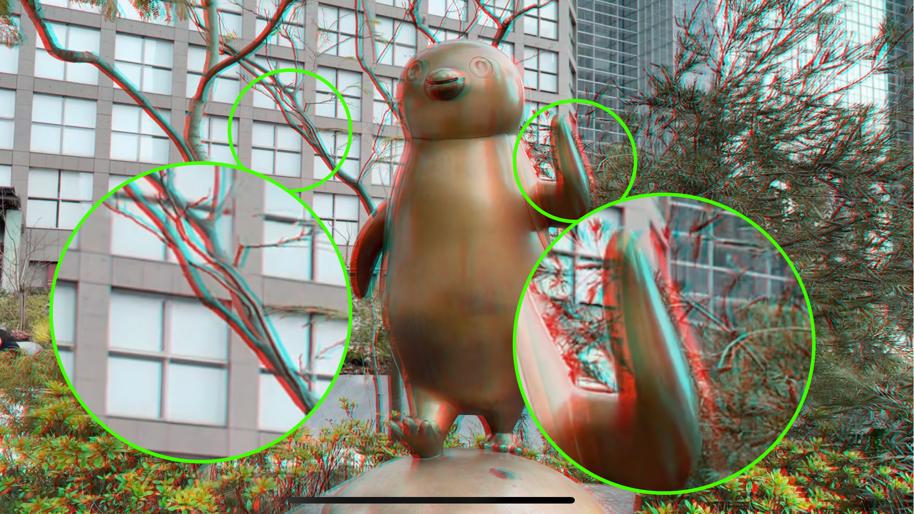
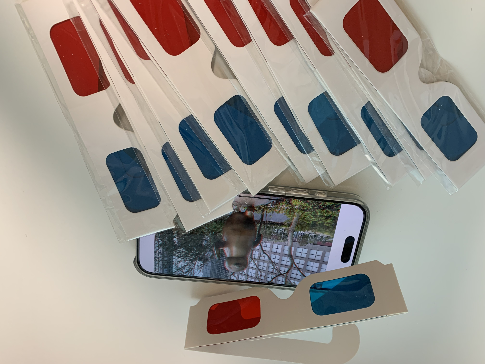

# spatial-video-to-anaglyph
Convert Apple's spatial videos to anaglyph videos.  
Anaglyphs enables stereoscopic vision by utilizing glasses with red and blue lenses.

Objects close to the viewer exhibit a more pronounced parallax effect, while distant objects show a smaller parallax, enhancing the perception of depth.

Enjoy your enhanced spatial video experience!

